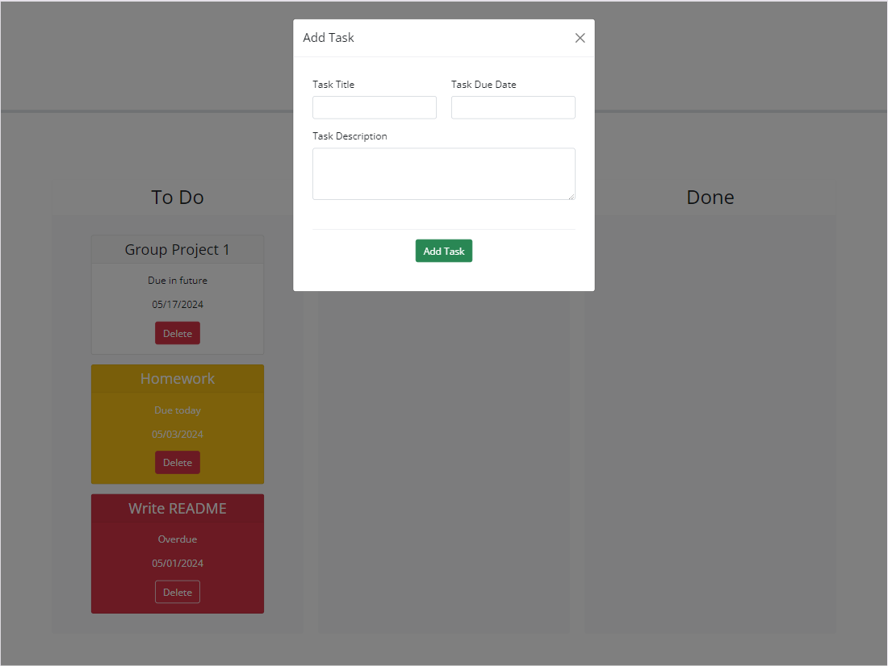
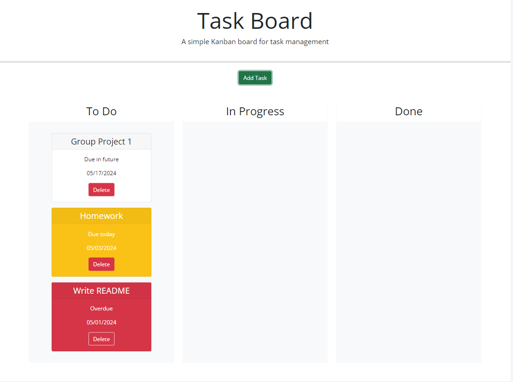
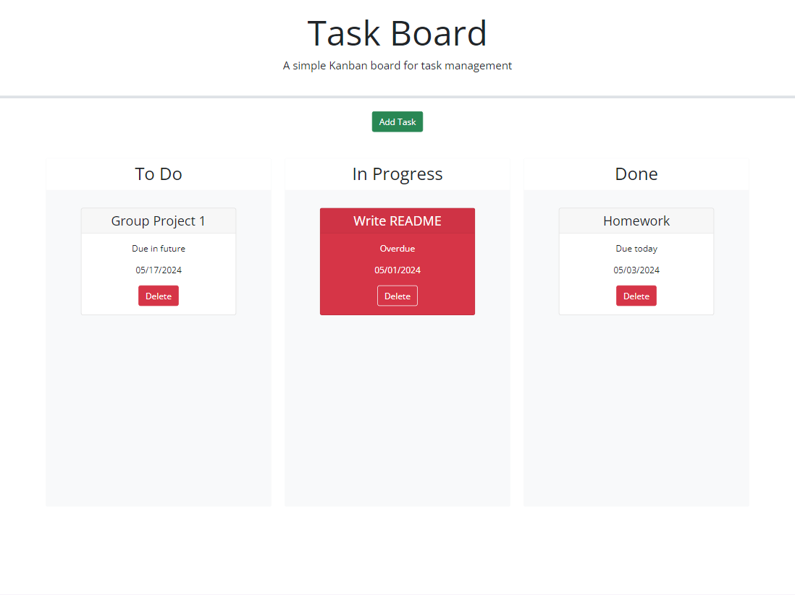

# Third-Party APIs: Task Board

## Description

This week's challenge involves modifying starter code to create a simple task board application allowing a team to manage project tasks. By creating this project management application, teams are able to keep track of due dates and progress. This application runs in the browser and features dynamically updated HTML and CSS powered by jQuery. 

## User Story

```md
AS A project team member with multiple tasks to organize
I WANT a task board 
SO THAT I can add individual project tasks, manage their state of progress and track overall project progress accordingly
```

## Acceptance Criteria

```md
GIVEN a task board to manage a project
WHEN I open the task board
THEN the list of project tasks is displayed in columns representing the task progress state (Not Yet Started, In Progress, Completed)
WHEN I view the task board for the project
THEN each task is color coded to indicate whether it is nearing the deadline (yellow) or is overdue (red)
WHEN I click on the button to define a new task
THEN I can enter the title, description and deadline date for the new task into a modal dialog
WHEN I click the save button for that task
THEN the properties for that task are saved in localStorage
WHEN I drag a task to a different progress column
THEN the task's progress state is updated accordingly and will stay in the new column after refreshing
WHEN I click the delete button for a task
THEN the task is removed from the task board and will not be added back after refreshing
WHEN I refresh the page
THEN the saved tasks persist
```

## Mock Up
The following images shows the web application's appearance:








## Link to Deployed Application 

https://vaughanknouse.github.io/task-board-third-party-api/


## Credits

Code from Module 5 Mini Project: Interactive Project Management App as well as the solution was utilized throughout this challenge. 

Used the following sources as tutorials and guidelines:

Day.js JavaScript library located at https://day.js.org/en/ for displaying dates.

https://developer.mozilla.org/en-US/docs/Web/API/Window/localStorage

Also utilized the Xpert Learning assistant for some portions of my code:
https://bootcampspot.instructure.com/courses/5293/external_tools/313